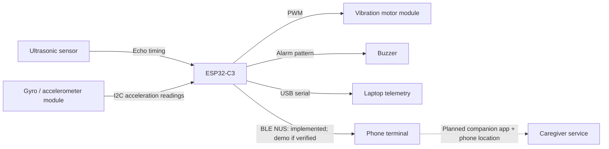

# Intelligent Cane: review and presentation notes for 5 October 2026

> Timing update: the later organizer announcement supersedes the original 12-minute recommendation with **4 minutes demo, 2 minutes progress check and 4 minutes Q&A**. Use `IoTrix_SemiFinal_Defense_and_Demo_Guide.md` for the current team script. Findings below describe the repository before the subsequent documentation corrections.

Reviewed against all four pages of **Semi Final Guidelines and Evaluation Criteria.pdf**, the active `firmware/core-sensing` implementation at commit `d7dccd5`, the wiring/BOM, tests, simulation and presentation documents. The team confirms the connected hardware is an ESP32-C3 SuperMini, ultrasonic sensor, gyro/accelerometer, vibration motor and buzzer. Physical operation and the firmware actually flashed to the board were not observed during this review.

**Verdict:** This is a credible scope for a Track A semi-final proof of concept, provided the physical demonstration works. The strongest evidence is the local sensor-to-feedback loop, supported by BLE telemetry if demonstrated. The largest weaknesses are unsupported presentation claims, limited recorded physical validation, and inconsistent electrical wiring instructions. Qualification cannot be predicted from a repository review.

**What was verified today**

- Existing host C++ tests passed: distance boundaries, invalid inputs, monotonic feedback, motor polarity, beep transitions and timer rollover. This is not whole-system test coverage.
- Active firmware compiled successfully for `esp32:esp32:esp32c3:CDCOnBoot=cdc,FlashMode=dio`, using installed Arduino-ESP32 3.3.2. Build output: 702,734 bytes flash (53%) and 24,744 bytes static/global RAM (7%). These figures do not measure runtime heap use or battery life.
- No firmware was changed or uploaded. Compilation and logic tests do not establish electrical correctness, physical sensing accuracy or usability.

Reproduction commands:

```sh
g++ -std=c++11 -Wall -Wextra -pedantic tests/proximity_feedback_test.cpp -o /tmp/proximity_feedback_test
/tmp/proximity_feedback_test
arduino-cli compile --fqbn esp32:esp32:esp32c3:CDCOnBoot=cdc,FlashMode=dio firmware/core-sensing
```

**How the project fits the rubric**

| Evaluation area | Weight | Assessment and best evidence to show |
|---|---:|---|
| Problem definition and proposed solution | 20% | Clear use case, but narrow today's claim to supplementary obstacle awareness and a cane orientation/impact alarm. Head-height coverage depends on mounting and beam direction. Drop-off protection is not in the active build. |
| System architecture and IoT integration | 25% | Explain the complete local input-processing-output loop. BLE NUS is implemented; demonstrate phone notifications if verified. Phone location, caregiver delivery and AI remain planned. Draw implemented and planned links differently. |
| Working progress / proof of concept | 30% | Compiling firmware and passing logic tests are useful. Repeated physical input changes, real readings and a short evidence video are the next priorities. |
| Technical reasoning and feasibility | 10% | Explain component choices, voltage conversion, motor driver, sensor limitations and the true cost boundary. Remove unmeasured timing/power claims. |
| Demonstration and Q&A | 5% | Prepare a predictable demonstration and concise answers. Although presentation has a 5% category, the demonstration also supplies evidence for other categories. |
| Track A technical validation | 10% | Hardware integration 4 marks, firmware operation 3, physical testing 3. Show real wiring, explain actual control logic, and let a judge change obstacle distance. |

The guidelines prioritize proof and engineering understanding, do not require production readiness, and explicitly make AI optional. Hardware quantity is not a scoring factor. Finishing an AI feature today is lower priority than a repeatable demonstration of the existing prototype.

**Corrections to make before presenting**

1. **Verify Echo level conversion before powering the next demonstration.** `hardware/wiring.md:91` and the BOM describe direct HC-SR04 Echo wiring, while `hardware/circuit_diagram.png` correctly depicts a divider. A conventional HC-SR04 outputs 5 V Echo; ESP32-C3 GPIO high-level input is specified up to VDD + 0.3 V. If that is your sensor, use level conversion now, including on a bench prototype. The schematic's 1 kOhm from Echo to GPIO junction and 1.8 kOhm from junction to ground produces approximately 3.21 V from 5 V. Power off before rewiring; verify actual components and common ground. Verify GY-521 I2C pull-ups are to 3.3 V and that the motor module actually includes a suitable driver. References: [Espressif datasheet, Table 5-4](https://documentation.espressif.com/esp32-c3_datasheet_en.html), [Adafruit HC-SR04 interface guidance](https://www.adafruit.com/product/3942).
2. **Describe the IMU function as a cane orientation/impact alarm.** The active code sets the alarm when tilt is at least 65 degrees OR acceleration magnitude is at least 2.5 g; it clears below 30 degrees when the trigger condition is absent. It has no 1.5-second debounce, free-fall/impact sequence or immobility check. A dropped cane does not establish that its user fell. Evidence: `core-sensing.ino:473-491`. Explain the mounting orientation: the calculation references the sensor's Z axis.
3. **Use the real obstacle thresholds.** Valid distances strictly below 60 cm activate both vibration and obstacle beeps; full motor duty is reached at 10 cm. At 60 cm and farther the obstacle feedback is off. The buzzer is not restricted to below 30 cm. An IMU alarm can sound independently. Evidence: `ProximityFeedback.h:13-26`, `core-sensing.ino:516-521`.
4. **Remove guarantees of sub-50 ms response and a fully non-blocking loop.** Sensor reads are attempted every 40 ms; Echo acquisition uses blocking `pulseIn(..., 26000)`, BLE sends include 4 ms delays between chunks, and IMU recovery also performs synchronous work. Telemetry is scheduled every 250 ms (nominally 4 updates/s), not 10 Hz. Measure end-to-end latency before quoting a bound. Evidence: `core-sensing.ino:38-48`, `:395`, `:463`, `:503-508`, `:527`.
5. **Separate recorded results from unsupported claims.** The current progress sheet asserts +/-1.5 cm accuracy, 10 m BLE range, <25 ms arrival latency, and a 30-minute thermal test below 32 C. No supporting measurement records were found. Keep a result only if your team actually performed and can explain that test. Existing host tests passing does not mean 100% code coverage. The documented `docs/test-logs/` folder is absent.
6. **Label future functions clearly.** There is no downward sensor in the active firmware. Camera, voice service, caregiver dashboard and phone location folders contain plans rather than implementations. The architecture document mixes the archived dual-ToF design with the present ultrasonic build. The Wokwi example also uses a different board/pin map and behavior; it is not validation of this exact firmware.
7. **Correct secondary claims.** No explicit battery-monitoring code or diagnostic no-echo vibration pattern is implemented. A missing Echo currently returns NaN, turns obstacle feedback off and prints `NO ECHO`; an independent IMU alarm may still sound. Do not say a missing Echo proves the path is clear. Do not promise phone MAC display: its population is conditional on the BLE stack configuration.
8. **Keep the cost claim precise.** Phase 1's listed components correctly total LKR 2,800. Including all optional and future BOM rows totals LKR 14,400, above the stated LKR 11,500-14,000 estimate. These are repository costs, not independently verified receipts or current supplier quotes. The base total excludes the cane structure, battery, enclosure, phone and ongoing connectivity/service costs.

The most affected materials are `docs/IoTrix_SemiFinal_Technical_Progress_Sheet.md`, `docs/IoTrix_SemiFinal_Defense_and_Demo_Guide.md`, `docs/architecture.md`, `docs/PROGRESS_REPORT.md` and the root README. Use this review to correct your spoken claims even if you cannot revise every document before presenting. Avoid saying "100% safe"; say "local obstacle feedback works without an internet connection" after demonstrating it.

**A useful 45-60 minute preparation sprint**

- First 10 minutes: inspect Echo level conversion, common ground, motor-driver wiring and the power connection. Secure loose wires and sensor orientation. Confirm the flashed firmware agrees with the reviewed behavior.
- Next 15 minutes: use a flat board and tape measure; collect repeated readings at 80, 60, 59, 40, 20 and 10 cm. At each point, save at least five readings and note actual vibration and beep behavior. Test tilt and recovery gently on a table. Test with the phone disconnected. If time is shorter, prioritize 80, 40 and 10 cm plus tilt/recovery.
- Next 10 minutes: capture a 30-60 second unedited demonstration clip and one close-up wiring photo. Keep them available offline. Save the real serial log with the firmware revision and test conditions.
- Next 10 minutes: correct the presentation claims and condense the progress sheet. The current 1,166-word Markdown sheet plus diagram is not demonstrated to fit one readable page; check the exported page count.
- Final 10 minutes: rehearse four minutes of demonstration and two minutes of progress, leaving four minutes within the 10-minute session for questions and a judge-controlled test. Keep the known-working build available; any late change needs a repeat of the demonstration checks.

Record observations in a table like this; these are expected software outputs, not measured results:

| Test input | Expected from current code, with no IMU alarm | Actual observation to record |
|---|---|---|
| 80 cm and exactly 60 cm | Motor off; obstacle buzzer silent | Distance readings, actual motor state |
| 59 cm | Motor starts at about 40% commanded duty; slow beeps | Readings and behavior across repeated trials |
| 40 cm | About 63% duty; faster beeps | Readings and physical vibration |
| 20 cm | About 87% duty; faster beeps | Readings and physical vibration |
| 10 cm | 100% commanded duty; rapid beeps | Readings and physical vibration |
| Tilt >=65 degrees with target kept far away | IMU alarm; no tilt-driven motor output | Mounted orientation and alarm behavior |
| Restore tilt <30 degrees without an impact spike | IMU alarm clears | Whether it clears reliably |
| Phone disconnected | Local feedback should continue | Repeat the near/far obstacle test |
| No Echo, if observed | `NO ECHO`; obstacle feedback off | Condition that produced it; do not label it clear |

The thresholds apply to the sensor's measured distance. Noise means an object placed at exactly 60 cm may produce readings on both sides; show that honestly. Average absolute error can be computed as mean(abs(measured distance - tape distance)); also report worst error, no-echo counts and the number of trials. A finite test set does not establish accuracy for all surfaces.

**A simple architecture slide**



The current alarm uses accelerometer data even though the module also contains a gyro. Explain that distinction if asked. Describe local processing as independent of a network service; do not claim hard real-time isolation from BLE work on the same MCU.

**Your opening, approximately 35 seconds**

> "We are building an affordable electronic extension to a white cane for supplementary obstacle awareness. Today's prototype reads an ultrasonic sensor on an ESP32-C3 and increases vibration as an obstacle gets closer. A buzzer provides audible alerts, and an inertial sensor detects cane tilt or impact. The feedback is computed locally. We will show the working input-to-output loop, our testing evidence, and the limitations we will address before the final. Phone-based caregiver alerts and AI scene descriptions are future extensions."

**Updated presentation sequence: 4 minutes demo, 2 minutes progress, 4 minutes Q&A**

| Time | Speaker and content |
|---|---|
| 0:00-0:20 | Dulnith: introduce the user problem and show the connected hardware. |
| 0:20-2:30 | Thenul: demonstrate actual feedback at 80, 40, 20 and 10 cm. |
| 2:30-4:00 | Chamith: demonstrate tilt/recovery and local operation without a phone. Show BLE only if already verified. |
| 4:00-5:00 | Suneth: explain current implementation, software evidence and cost exclusions. |
| 5:00-6:00 | Suneth: state limitations and priorities before the final. |
| 6:00-10:00 | All four: Q&A and judge-selected input changes. |

All members attend with cameras on. See the updated defense guide for speaking notes.

For a demo failure, use the saved video and logs while stating exactly what failed live. A recording supplements the mandatory live demonstration; do not assume it replaces it. Keep the USB serial monitor ready if BLE pairing fails. Do not perform a real fall or blindfolded obstacle walk.

**Answers to rehearse**

- **Why this architecture instead of something simpler?** "Distance-only sensing could use a simpler controller. We chose this board because it also provides the interfaces, PWM and BLE needed for our extension path. Local feedback does not require the phone or cloud. We are still validating timing under communication load."
- **Why BLE?** "The present link sends small telemetry messages to a nearby phone through GATT notifications. That phone can provide the location and internet uplink in the next phase. We have not yet established battery-life or latency figures."
- **What happens without a network?** "Local sensing and feedback are computed on the cane. We can demonstrate them with the phone disconnected. Future caregiver alerts will depend on the phone and network and need explicit delivery status."
- **Does it detect the user's fall?** "Today it detects cane tilt or acceleration above thresholds. A dropped cane can trigger it. We need time-based classification, false-alarm tests and a cancel flow before treating an event as a possible user fall."
- **How did you validate it?** "The firmware compiles and the existing proximity logic tests pass. These are our physical test conditions, readings and observed outputs." Show only data actually collected.
- **What is the highest risk?** "A missed obstacle or loss of sensor coverage can leave the user without a useful warning. No Echo is ambiguous. We need a persistent-fault indication, broader surface tests and mounting validation."
- **What would you improve first with one month?** "We would improve reliability of the existing sensing and feedback, evaluate it with intended users under supervision, then complete and test one end-to-end caregiver alert."
- **What fails in deployment?** "Loose wiring, sensor occlusion, an exhausted battery or a disconnected phone are plausible failures. Secure mounting, fault indication, power measurement and explicit connection/delivery state are planned mitigations; not all are implemented today."

**Improvements with the strongest engineering value for the final**

1. **Make failure distinguishable from clear space.** Count consecutive invalid/stale readings and design a distinct diagnostic indication after a tested timeout. Keep it separate from obstacle urgency. Test missing sensors, out-of-range targets and phone loss. No Echo alone does not prove hardware failure.
2. **Validate warning distance and feedback usability.** At an illustrative approach speed of 1 m/s, 60 cm represents only 0.6 seconds before contact, before sensing, motor and human response delays. Test an earlier warning range, filtering and threshold hysteresis against false alarms and delay. Consider a user-selectable quiet mode with haptics as the primary channel; the current firmware also beeps throughout the active range. Evaluate normal cane angles, weight and handle vibration with intended users and mobility practitioners.
3. **Treat cane motion carefully.** Calibrate the mounted IMU orientation; test ordinary sweeps, taps, placement on a table, drops and pickup. Add a timed event sequence and cancel/acknowledgment behavior only after defining the expected outcomes. Do not infer a human fall from one threshold crossing.
4. **Strengthen the existing firmware.** Use asynchronous Echo timing and queued telemetry if latency testing warrants it. Replace the BLE command substring check (any lowercase `r` currently matches) with exact commands, and protect remote alarm controls before deployment. Fix the I2C pin mapping for the assembled product and verify initialization writes; the current direct-register fallback marks the device available without checking those write results.
5. **Complete one visible IoT workflow.** Send a versioned event with sequence/timestamp -> phone attaches location plus accuracy/freshness -> caregiver receives an acknowledged alert. Show last-seen time and failed delivery honestly. Choose one phone platform first and test disconnect/reconnect and background operation. Location sharing should be opt-in.
6. **Make power and mechanics measurable.** Secure wiring and add strain relief before investing in a custom PCB. Measure average and peak current, total weight and tested runtime. Distinguish electronics cost from complete product cost. Do not promise a 24-hour battery life without a measurement or stated calculation.
7. **Add coverage or AI only to solve a demonstrated gap.** A downward sensor needs mounting/ground-baseline validation if drop-off detection stays in scope. Complementary sensing should be tested across surfaces. On-demand scene narration can be a later convenience feature with explicit uncertainty; it should not be presented as the real-time obstacle controller.

**Submission check for today**

The PDF says to submit the repository link and project proposal through the organizers' link on 5 October. It also calls for a one-page technical progress sheet, architecture diagram, implementation evidence, technology stack/components, test results, limitations/risks, planned improvements and a live technical demonstration. Its section 5 provides the recommended eight-part progress-sheet structure.

The repository contains drafts for most of these, but the proposal file and raw physical test logs were not found in this checkout. Check any separately held proposal, export a genuinely readable one-page sheet, attach real evidence and ensure judges can access the intended repository revision. Submission status and GitHub accessibility were not verified during this review.
