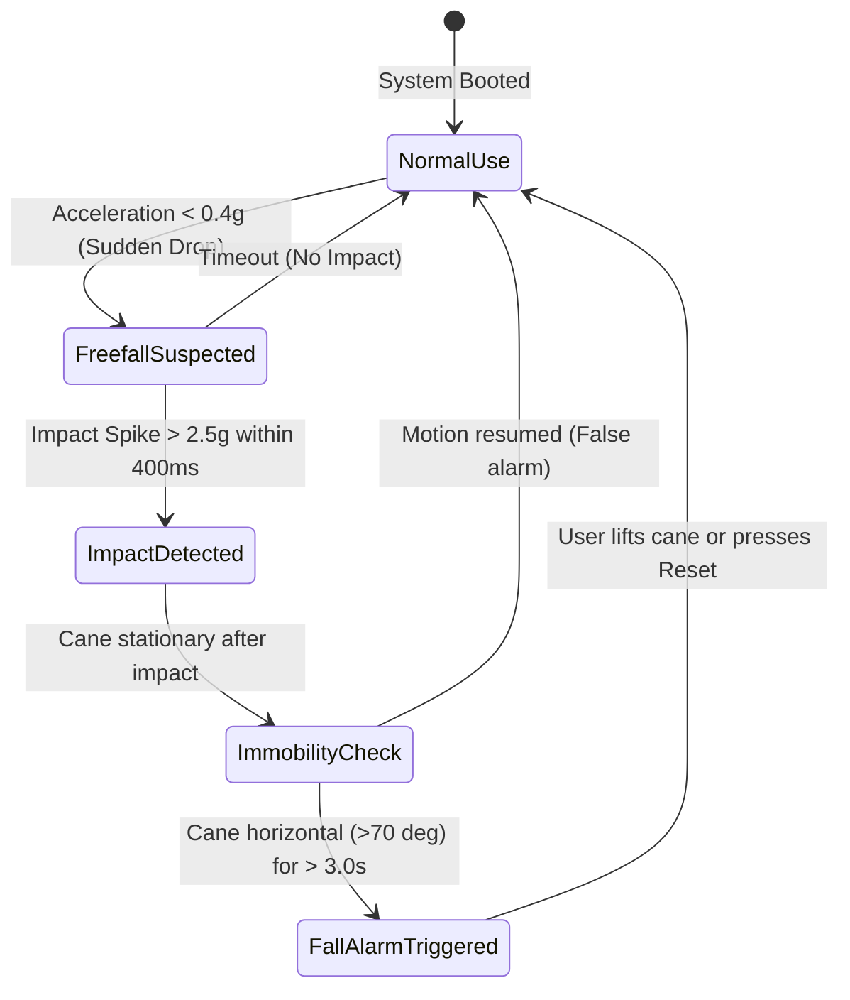

# Intelligent Cane — System Architecture

**Neural-Nexus IoTrix 2.0 (Track A: Embedded IoT System Development)**

---

## 1. System Overview

The Intelligent Cane is designed to empower visually impaired individuals with safe, proactive, and independent navigation. The complete solution spans three modular subsystems:

```mermaid
flowchart TD
    subgraph Subsystem1 ["Subsystem 1: Safety-Critical Sensing (ESP32-C3 SuperMini - Offline)"]
        US["HC-SR04 Ultrasonic Distance Sensor"]
        IMU["MPU6050 6-Axis IMU (Tilt / Fall)"]
        MCU1["ESP32-C3 SuperMini Controller"]
        VIB["Haptic Vibration Motor (200Hz LEDC PWM)"]
        BUZZ["Emergency Buzzer (GPIO 7)"]
        BTN["SOS / Reset Pushbutton (GPIO 3)"]
        
        US -->|Trig: GPIO 0, Echo: GPIO 1| MCU1
        IMU -->|I2C: SDA 4, SCL 5| MCU1
        BTN -->|GPIO 3 Pullup| MCU1
        MCU1 -->|LEDC PWM Intensity| VIB
        MCU1 -->|Urgent Hazard Tone| BUZZ
    end

    subgraph Subsystem2 ["Subsystem 2: Cloud Telemetry & Tracking (Phase 2)"]
        GPS["NEO-6M / 8M GPS"]
        MCU2["GPS / Telemetry Task"]
        DASH["Caregiver Web Dashboard"]
        
        GPS -->|UART| MCU2
        MCU2 -->|Wi-Fi HTTP / MQTT / LoRa| DASH
    end

    subgraph Subsystem3 ["Subsystem 3: AI Vision & Voice Pipeline (Phase 3)"]
        CAM["ESP32-CAM (OV2640)"]
        VLM["Off-Device AI Voice Service (VLM + TTS)"]
        EAR["Bluetooth Earpiece / User Audio"]
        
        CAM -->|Wi-Fi Snapshot| VLM
        VLM -->|Spoken Audio Description| EAR
    end
```



---

## 2. Phase 1 Firmware Architecture (`core-sensing`)

Phase 1 operates with zero cloud or internet connectivity. It must guarantee deterministic response times ($\le 50\text{ ms}$) from physical hazard detection to tactile feedback.

### 2.1 Software Component Hierarchy

```
firmware/core-sensing/
├── include/
│   ├── config.h             # Pin definitions, thresholds, sensor types, timing
│   ├── ForwardSensor.h      # VL53L1X ToF distance driver
│   ├── DownwardSensor.h     # Downward ground sensing abstraction (Ultrasonic / VL53L0X)
│   ├── MotionSensor.h       # MPU6050 tilt and fall detector
│   ├── HapticFeedback.h     # Non-blocking PWM & rhythmic vibration sequencer
│   ├── BuzzerAlert.h        # Audible alarm generator for critical proximity
│   └── CaneController.h     # Master coordinator executing the safety state machine
└── src/
    ├── ForwardSensor.cpp
    ├── DownwardSensor.cpp
    ├── MotionSensor.cpp
    ├── HapticFeedback.cpp
    ├── BuzzerAlert.cpp
    ├── CaneController.cpp
    └── main.cpp             # Arduino setup() and loop() entry points
```

---

## 3. Sensory Feedback & Alert Logic

### 3.1 Forward Obstacle Proximity Mapping

Forward distance measured by the VL53L1X laser ToF is mapped continuously to vibration motor PWM duty cycle (closer obstacles produce exponentially or linearly increasing vibration):

| Distance ($d$) | Alert Level | Vibration Motor Duty Cycle | Buzzer Status | Status LED |
|:---|:---|:---:|:---:|:---:|
| $d > 150\text{ cm}$ | Clear | 0% (OFF) | Silent | Solid Green / Slow pulse |
| $80\text{ cm} < d \le 150\text{ cm}$ | Caution | 30% – 60% (Gradual) | Silent | Solid Green |
| $30\text{ cm} < d \le 80\text{ cm}$ | Warning | 60% – 95% (Strong) | Silent | Amber Blink |
| $d \le 30\text{ cm}$ | **Critical** | **100% (Continuous Maximum)** | **Active Warning Tone** | Rapid Red Blink |

$$\text{PWM Duty} = \text{constrain}\left(255 - \frac{d - d_{min}}{d_{max} - d_{min}} \times (255 - \text{PWM}_{min}),\ \text{PWM}_{min},\ 255\right)$$

### 3.2 Drop-off Detection (Curbs, Stairs, Holes)

1. Ground distance ($h_{ground}$) is measured at an inclined downward angle ($\approx 45^\circ$).
2. A normal walking baseline is dynamically tracked or calibrated (nominal $\approx 35 - 45\text{ cm}$).
3. When $h_{ground} > h_{baseline} + \Delta h_{thresh}$ (e.g. $> 60\text{ cm}$) or when out-of-range beam reflection occurs:
   - **Drop-off Trigger Active**: Overrides forward proximity vibration with a distinct **double-pulse rhythmic burst**:
     - `150ms ON` $\rightarrow$ `80ms OFF` $\rightarrow$ `150ms ON` $\rightarrow$ `250ms OFF`.
   - Tactile signature is instantly distinguishable from steady proximity buzz.

### 3.3 Fall Detection State Machine (MPU6050)



---

## 4. Loop Timing & Non-blocking Scheduling

All sensor drivers and actuator patterns run non-blockingly using cooperative millisecond scheduling in `loop()`:

- **Forward Sensor (VL53L1X)**: Sampled every **30 ms (~33 Hz)** in Short/Medium distance mode.
- **Downward Sensor (Ultrasonic/ToF)**: Sampled every **50 ms (20 Hz)**.
- **IMU (MPU6050)**: Sampled every **20 ms (50 Hz)** for responsive tilt/fall tracking.
- **Actuator Update (Haptic & Buzzer)**: Updated every **10 ms (100 Hz)** for precise pulse timings without `delay()`.
- **Serial Diagnostics Telemetry**: Formatted packet output every **100 ms (10 Hz)** for real-time serial plotting.
