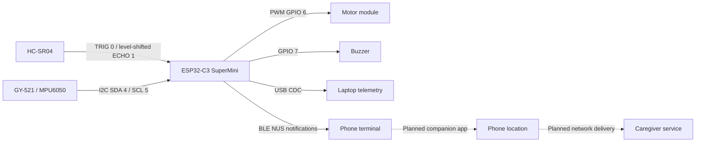

# Current Intelligent Cane architecture

**As of 5 October 2026.** Active implementation: `firmware/core-sensing/`. The archived dual-ToF design and Wokwi example are not the current physical build.

Solid connections identify implemented firmware interfaces, not a claim that every physical path has passed bench testing. Dashed connections are future work. Camera/AI and downward sensing are outside this build.

## Control logic

For valid distance d below 60 cm, proximity = min((60-d)/50, 1). Motor duty = integer(100 + 155*proximity), on an 8-bit 0-255 scale. At d >=60 cm or invalid/nonpositive d, obstacle motor output is zero. PWM frequency is 200 Hz. Obstacle beep ON time increases from about 60 to 200 ms and OFF time decreases from about 740 to 40 ms. Active-buzzer mode is selected by default; passive mode additionally changes tone frequency.

The IMU alarm sets when tilt >=65 degrees OR acceleration magnitude >=2.5 g. It clears below 30 degrees when the triggering condition is absent. Tilt uses the magnitude of the sensor Z-axis acceleration relative to total acceleration, so mounting orientation matters. No timed free-fall, debounce or immobility sequence is present. The alarm uses a 200 ms ON / 200 ms OFF buzzer pattern and does not override motor distance gating.

## Timing and communications

- Sensor reads are attempted every 40 ms.
- `pulseIn` may block for up to its configured 26,000 microsecond timeout.
- Telemetry is scheduled every 250 ms, nominally 4 updates/s.
- BLE messages are split into chunks of at most 20 bytes, with 4 ms delays between chunks.
- MPU retry attempts occur every 2 seconds while unavailable and perform synchronous work.

This is cooperative loop scheduling with blocking operations. End-to-end response time has not been measured. BLE runs on the same MCU as local feedback.

## Failure handling and gaps

No Echo returns NaN and disables obstacle feedback. Telemetry labels it NO ECHO unless the IMU alarm takes precedence. It is an unknown distance, not verified clear space. An unavailable MPU appears as NO_MPU. Distinct user-facing sensor fault feedback is future work.

BLE disconnect handling restarts advertising. Location, buffering, caregiver delivery acknowledgments, battery monitoring and remote-control security are not complete. The reset parser currently accepts any received string containing lowercase `r`, so a strict command parser is a planned correction.

## Electrical reference

See `hardware/circuit_diagram.png` and `hardware/wiring.md`. Use a common ground, 3.3 V I2C pull-ups, Echo level conversion, and a verified motor driver. These requirements apply to the bench prototype.
