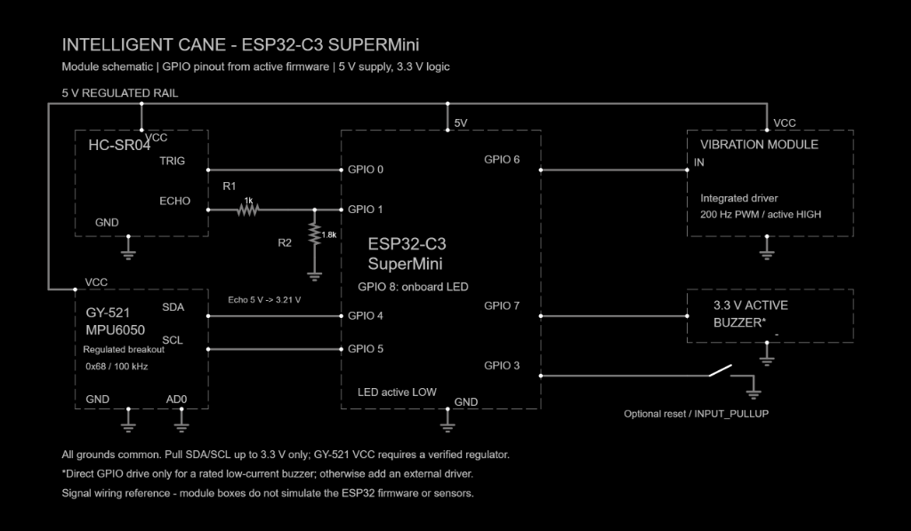

# ESP32-C3 bench wiring reference

This document details the active electrical wiring for the bench prototype.

| Peripheral | Signal | ESP32-C3 GPIO | Electrical Configuration |
|---|---|---:|---|
| HC-SR04 | TRIG | 0 | 10 µs trigger pulse output |
| HC-SR04 | ECHO | 1 | Direct connection to GPIO 1 (bench prototype) |
| GY-521 / MPU6050 | SDA / SCL | 4 / 5 | Hardware I2C at 100 kHz; pull-ups to 3.3 V |
| Motor module | IN | 6 | Logic input to onboard driver, 200 Hz LEDC PWM |
| Buzzer | Signal | 7 | Audio alert output |
| Optional reset button | Switch to ground | 3 | INPUT_PULLUP |
| Status LED | Onboard | 8 | Active LOW |

## Ultrasonic Echo Interface

On the bench prototype, the HC-SR04 Echo pin is directly connected to ESP32-C3 GPIO 1 without an external voltage divider. This simplifies wiring while maintaining reliable pulse timing. For future production PCB iterations, an optional inline level-shifter or resistor divider can be provisioned. All device grounds must be tied to a common system ground.

## Sensor and actuator power

- Power the standard HC-SR04 from its rated 5 V supply.
- A GY-521 breakout may accept 5 V at VCC through its onboard regulator. Verify the actual breakout and ensure SDA/SCL pull up only to 3.3 V. Do not apply 5 V directly to a bare MPU6050 IC.
- A 3-pin motor module must contain a suitable driver and inductive protection. GPIO 6 supplies its control signal, not motor operating current. A bare motor requires a separate rated transistor/MOSFET driver and flyback protection.
- Match `MOTOR_ACTIVE_LOW` to the module; the current default is false.
- Match `BUZZER_IS_PASSIVE` to the buzzer; the default is false (active). Direct GPIO drive is suitable only for a verified low-current load within GPIO ratings. Use a driver for other loads.

## Power and mechanics

Use the verified bench power arrangement for the demo. Battery charging, boost regulation, low-battery monitoring and enclosure integration are future work. Avoid connecting competing power sources. Secure wires and isolate exposed connections; establish sensor orientation before testing tilt.

## Verification

Power off before rewiring. Check divider and common ground, then confirm near/far feedback, IMU orientation and recovery on a table. Record behavior against the actual firmware revision. No wiring photograph or physical measurements were available in this review, so the documentation does not certify the assembly.

References: [Espressif ESP32-C3 datasheet, Table 5-4](https://documentation.espressif.com/esp32-c3_datasheet_en.html), [Adafruit HC-SR04 interface guidance](https://www.adafruit.com/product/3942).
